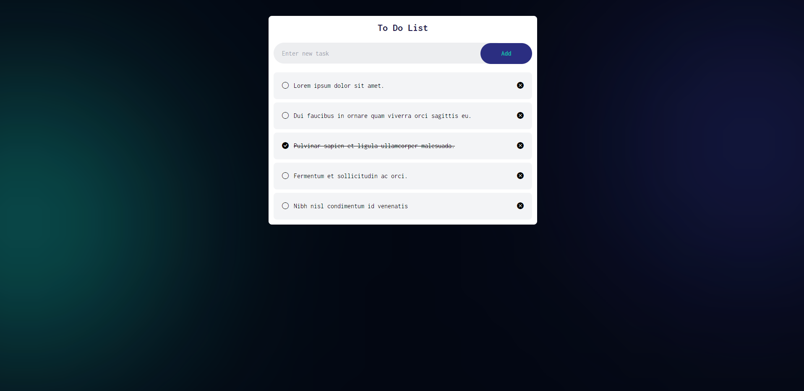

# React TODO Application with
- Environment Setup
- Components
- JSX Configs
- Rendering List
- useState Hooks
- Passing Props
- useRef Hooks
- useEffect Hooks
- **Frond-end CSS framework: Tailwind CSS**
- Storage: LocalStorage

## Live Preview
[https://react-todo-application-beta.vercel.app](https://)


## Tips
### Create React Project with Vite
- First intall Node JS to your PC.
- Open the command prompt or Terminal and navigate to the directory where you want to create a new project. Then, type : `npm create vite@latest`
<pre><code>npm create vite@latest</code></pre>
- Then add a `project name` and select framework : `react`
<br/>
- After that select a variant : `JavaScript + SWC`

#### Open your project using code editor
- Open the code editor terminal and type : `npm install`
<pre><code>npm install</code></pre>
- After that type : `npm run dev` 
<pre><code>npm run dev</code></pre>

## Setup Tailwind CSS to Vite React App
[https://tailwindcss.com/docs/guides/vite](https://)
#### Install Tailwind CSS
- Install `tailwindcss` and its peer dependencies, then generate your `tailwind.config.js` and `postcss.config.js` files.
<pre><code>npm install -D tailwindcss postcss autoprefixer</code></pre>
<pre><code>npx tailwindcss init -p</code></pre>
#### Configure your template paths
- Add the paths to all of your template files in your `tailwind.config.js` file.
```javascript
export default {
  content: [
    "./index.html",
    "./src/**/*.{js,ts,jsx,tsx}",
  ],
  theme: {
    extend: {},
  },
  plugins: [],
}
```
#### Add the Tailwind directives to your CSS
```javascript
@tailwind base;
@tailwind components;
@tailwind utilities;
```
- Then tyepe : `npm run dev` 
<pre><code>npm run dev</code></pre>

#### Start using Tailwind in your project
- Start using Tailwind’s utility classes to style your content.
```javascript
export default function App() {
  return (
    <h1 className="text-3xl font-bold underline">
      Hello world!
    </h1>
  )
}
```
## References
**Tailwind CSS** : https://tailwindcss.com/
<br/>
**React** : https://react.dev/

#### Thank You.

